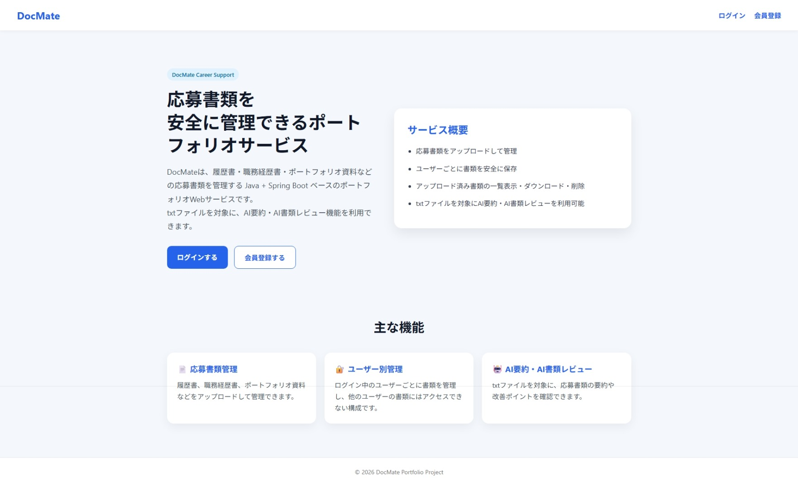
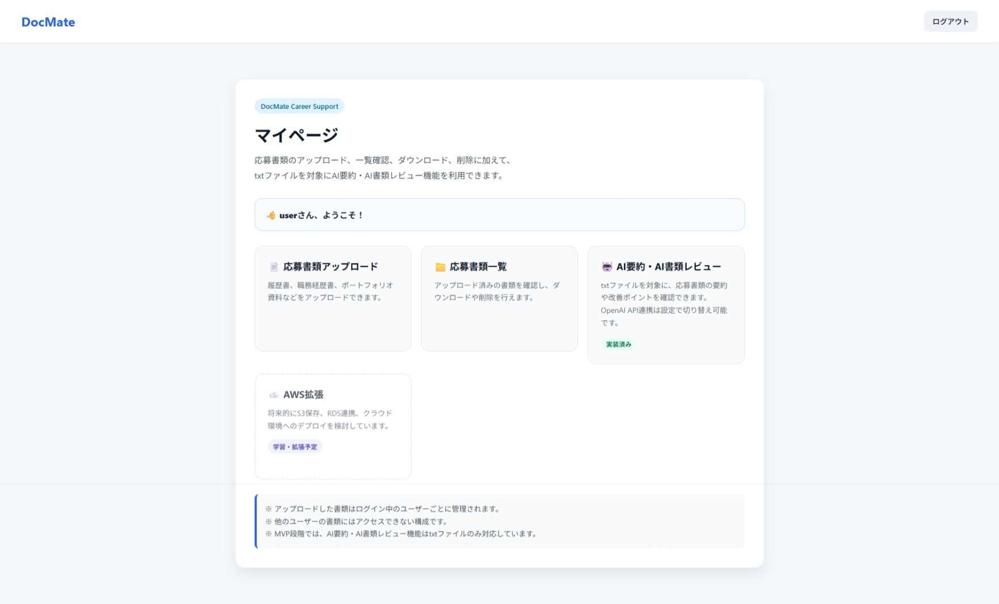
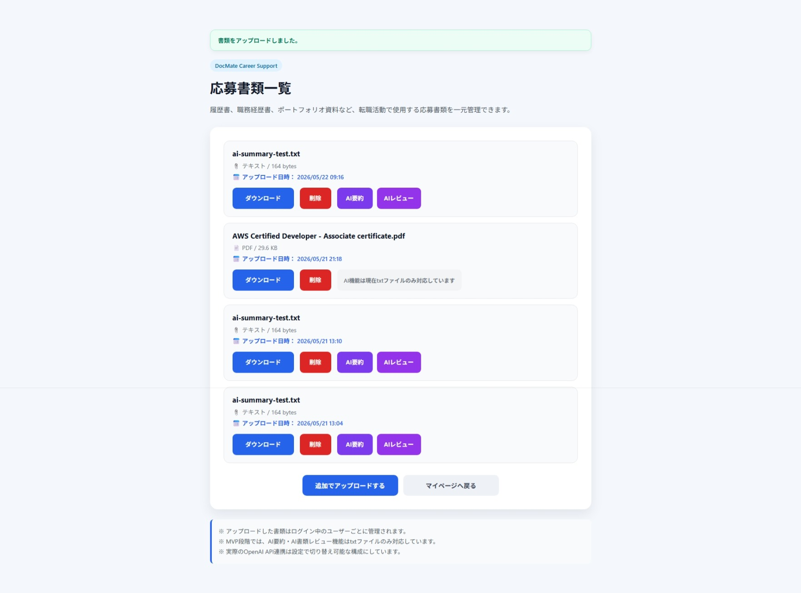
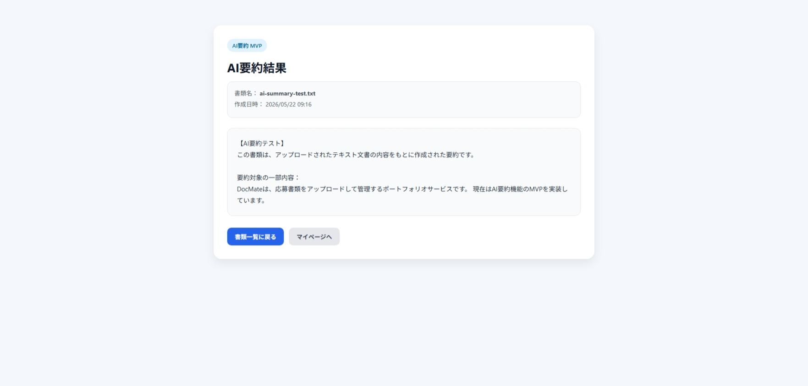
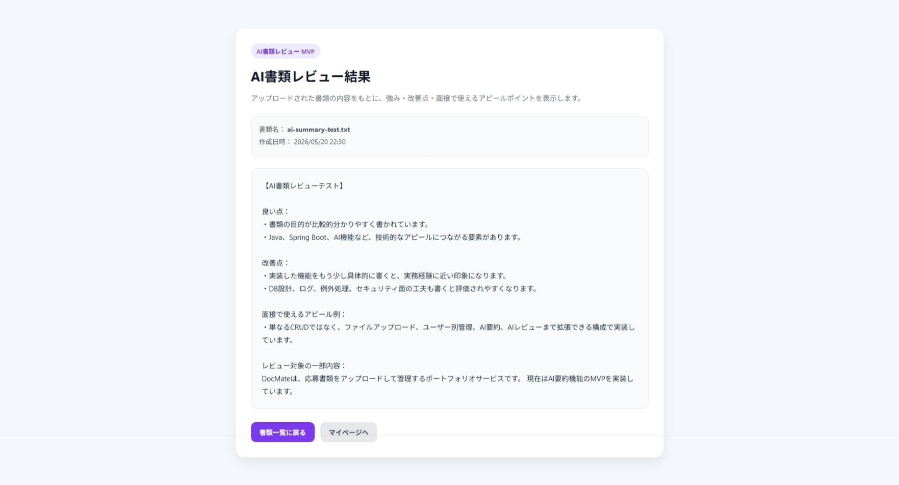

# DocMate

**DocMate** は、Java / Spring Bootで開発したAI文書管理Webアプリケーションです。  
転職活動で使用する応募書類をアップロード・管理し、AIによる要約・書類レビューを行うことができます。

---

## ポートフォリオ概要

DocMateは、履歴書・職務経歴書・ポートフォリオ資料などの応募書類をユーザーごとに管理できるWebアプリケーションです。

ログインユーザーごとに書類データを分離し、自分がアップロードした書類のみ閲覧・ダウンロード・削除・AI要約・AI書類レビューを行えるようにしています。

このプロジェクトでは、単純なCRUDだけではなく、以下のような実務に近いバックエンド開発を意識して実装しました。

- Spring Securityによるログイン認証
- ログインユーザーごとのデータ管理
- ファイルアップロード・ダウンロード・削除
- Spring Data JPAによるDB操作
- Document、Summary、Reviewのリレーション設計
- 外部キー制約を考慮した削除処理
- AI要約・AI書類レビュー機能
- Fake実装とOpenAI API実装を切り替え可能な設計
- APIキーを環境変数で管理する構成

MVP段階では、AI要約・AI書類レビュー機能はtxtファイルのみ対応しています。

---

## 画面イメージ

### トップページ



DocMateの概要、主な機能、ログイン・会員登録への導線を表示します。

### マイページ



応募書類アップロード、応募書類一覧、AI要約・AI書類レビュー機能へ移動できます。

### 応募書類一覧画面



アップロード済み書類を一覧表示し、ダウンロード・削除・AI要約・AIレビューを実行できます。  
MVP段階では、AI機能はtxtファイルのみ対応しています。

### AI要約結果画面



txtファイルの内容を読み取り、AI要約結果を画面に表示します。  
要約結果はDBに保存されます。

### AI書類レビュー結果画面



txtファイルの内容をもとに、書類の良い点・改善点・面接で使えるアピールポイントを表示します。  
レビュー結果はDBに保存されます。

---

## 開発背景

現職ではPHPを用いたWebシステムの保守・開発を担当し、DB調査、API連携、障害対応、詳細設計、実装、単体テストを経験しました。

今後はJava / Spring Bootを中心としたバックエンドエンジニアとして成長したいと考え、認証、ファイル管理、DB設計、AI API連携など、実務に近い要素を含めた本アプリを開発しました。

また、AI時代に対応できるバックエンドエンジニアを目指し、OpenAI APIと連携可能なAI要約・AI書類レビュー機能を実装しました。

---

## 主な機能

### ユーザー機能

- 会員登録
- ログイン
- ログアウト
- パスワード暗号化
- Spring Securityによる認証制御

### 応募書類管理機能

- 応募書類アップロード
- アップロード済み書類一覧表示
- ユーザーごとの書類管理
- 書類ダウンロード
- 書類削除
- 実ファイルが存在しない場合でもDBデータを安全に削除できる処理

### AI要約機能

- txtファイルの内容を読み取り、AI要約を作成
- 要約結果をDBに保存
- 要約結果を画面に表示
- 開発時はFake実装を利用
- OpenAI API実装へ切り替え可能な構成

### AI書類レビュー機能

- txtファイルの内容をもとに、書類の良い点・改善点・面接で使えるアピールポイントを表示
- レビュー結果をDBに保存
- レビュー結果を画面に表示
- MVP段階ではFake実装を利用
- 将来的にOpenAI API実装へ拡張可能な構成

---

## 使用技術

| 区分 | 技術 |
|---|---|
| 言語 | Java 17 |
| フレームワーク | Spring Boot 3 |
| テンプレート | Thymeleaf |
| 認証 | Spring Security |
| ORM | Spring Data JPA |
| DB | PostgreSQL |
| フロント | HTML / CSS |
| AI連携 | OpenAI API / Fake実装 |
| 開発環境 | IntelliJ IDEA / Windows |

---

## アプリケーション構成

```text
com.park.docmate
├─ user
│  └─ repository
├─ document
│  ├─ controller
│  ├─ service
│  └─ repository
├─ summary
│  ├─ controller
│  ├─ service
│  └─ repository
├─ review
│  ├─ controller
│  ├─ service
│  └─ repository
└─ common
```

---

## AI機能の設計

AI要約・AI書類レビューは、Clientインターフェースを用意し、処理をServiceから分離しています。

これにより、開発中はFake実装を使用し、必要に応じてOpenAI API実装へ切り替えやすい構成にしています。

### AI要約

```text
SummaryService
→ AiSummaryClient
→ FakeAiSummaryClient / OpenAiSummaryClient
```

### AI書類レビュー

```text
DocumentReviewService
→ AiReviewClient
→ FakeAiReviewClient
```

AI要約ではOpenAI API実装も作成しており、設定値によってFake実装とOpenAI実装を切り替えられる構成にしています。

```properties
ai.summary.provider=fake
ai.review.provider=fake
```

OpenAI APIを使用する場合は、APIキーをソースコードに直接記述せず、環境変数から読み込むようにしています。

```properties
openai.api-key=${OPENAI_API_KEY:}
openai.model=gpt-4.1-mini
```

---

## DB設計のポイント

書類データに対して、AI要約結果とAIレビュー結果が紐づく構成です。

```text
users
 └─ documents
      ├─ summaries
      └─ document_reviews
```

書類削除時には、外部キー制約を考慮し、関連するAI要約・AIレビュー結果を先に削除してから書類データを削除するようにしています。

---

## 工夫した点

- ログインユーザー本人の書類のみ操作できるようにした点
- ダウンロード用の取得処理と削除用の取得処理を分離した点
- 実ファイルが存在しない場合でも、DB上の書類データを安全に削除できるようにした点
- AI処理をServiceに直接書かず、Clientインターフェースとして分離した点
- Fake実装とOpenAI API実装を設定で切り替えやすい構成にした点
- txtファイル以外ではAIボタンを表示せず、ユーザーが誤操作しないUIにした点
- faviconなどの不要なエラーログも整理した点

---

## 苦労した点・解決方法

### 1. 書類削除時の外部キー制約

Documentに対してSummaryやReviewが紐づいているため、Documentだけを先に削除しようとすると外部キー制約の問題が発生しました。

そのため、削除処理では関連するSummaryやReviewを先に削除し、その後Documentを削除する流れに修正しました。

### 2. 実ファイルが存在しない場合の削除処理

当初はダウンロード用の取得処理を削除処理でも利用していたため、実ファイルが存在しない場合にDBデータの削除前に例外が発生する問題がありました。

そのため、ダウンロード用の取得処理と削除用の取得処理を分離し、実ファイルが存在しない場合でもDB上の書類データを安全に削除できるように改善しました。

### 3. AI処理の切り替え

AI要約処理をService内に直接実装すると、Fake実装とOpenAI API実装の切り替えが難しくなるため、AI処理をClientインターフェースとして分離しました。

これにより、開発中はFake実装を使用し、本番利用時にはOpenAI API実装へ切り替えやすい構成にしました。

---

## 今後の改善予定

- PDFファイルの内容読み取り対応
- Wordファイルの内容読み取り対応
- AI書類レビューのOpenAI API実装
- OpenAI APIを利用した本番AI要約・レビューの精度改善
- AWS S3へのファイル保存
- AWS RDSへのDB移行
- AWS環境へのデプロイ
- AI要約・AIレビュー結果の履歴一覧機能
- UIデザインのさらなる改善

---

## 実行方法

### 1. PostgreSQLを準備

PostgreSQLでDocMate用のDBを作成します。

### 2. application.propertiesを設定

DB接続情報を設定します。

例：

```properties
spring.datasource.url=jdbc:postgresql://localhost:5432/docmate
spring.datasource.username=your_username
spring.datasource.password=your_password
```

AI要約・AIレビューは、開発時はFake実装を使用します。

```properties
ai.summary.provider=fake
ai.review.provider=fake
```

OpenAI APIを使用する場合は、環境変数にAPIキーを設定します。

```text
OPENAI_API_KEY=your_api_key
```

### 3. アプリケーション起動

IntelliJ IDEAからSpring Bootアプリケーションを起動します。

```text
http://localhost:8081
```

---

## 注意事項

このプロジェクトはポートフォリオ用に作成した学習・デモ目的のアプリケーションです。

APIキー、DBパスワード、アップロード済みファイルなどの機密情報はGitHubに含めないようにしています。

また、MVP段階ではAI要約・AI書類レビューの対象ファイルをtxtファイルに限定しています。
